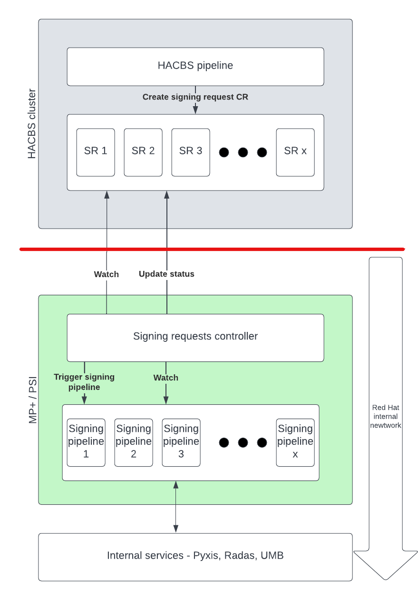

# HACBS signing requests using CRDs

This repository demonstrates a possible usage of Custom Resource Definition as a main driver of handling processes/workflows outside of available context. The external service (HACBS) requires a processes and workflows that are only available outside of HACBS context. Usually behind Red Hat firewall. The initial idea of exposing externally available webhooks was rejected due to a security concerns.

The repository provides a proof of concept of handling HACBS requests using Custom Resources and controller. The controller is an application that runs insider the VPN and has access to all internal workflows. At the same time the controller can access HACBS cluster and watches for new Custom Resource.

### Architecture and sequence diagram
See the following diagram:

 


1) HACBS pipeline creates a Signing request custom resource
2) Signing request controller watches for new SRs
3) The controller updates SR status to "in progress"
4) The controller triggers signing pipeline
5) The controller watches pipelines to finish
6) The controller updates SR status to "completed"


### How to run the demo app?
The Python application is based on `kopf` library that simplifies a communication with Kubernetes.
```
# First install dependencies
$ pip install -r requirements.txt

# Create demo pipeline
oc create -f crd-example-demo-pipeline.yml,task-curl.yml

# Export the ocp namespace
export CRD_DEMO_NAMESPACE=araszka-signing-controller

# Run watcher application
$ kopf run kopf-watch.py

# To create a new Custom Resource use the following script
$ python create.py
```